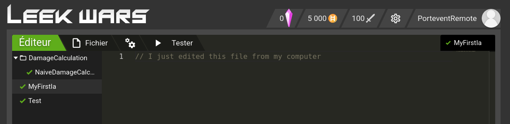

# 🥬 NodeLeek
Simple NodeJs client for LeekWars.
Uses OpenAPI to autogenerate API client (specifications are handwritten as no official uptodate spec exists).

```typescript
var nodeLeek = new NodeLeekClient();
nodeLeek.login("YOUR_ACCOUNT", "YOUR_PASSWORD").then(() =>
    nodeLeek.gardenGetGet().then(garden => console.log("I have " + garden.fights + " fights"))
    nodeLeek.fetchFile(nodeLeek.farmer.files['myreworkediaagainagain2bis/new/mynewia'].id, 0).then(file => console.log("My AI code is : \n" + file.code))
);
```

> ❗ Work in progress, we recommend to set `-- --readonly` on first uses to ensure no damages are done


Done :
- /farmer 
  - /login : partially, some part of the response (such as chat message) aren't done yet
- /garden
  - /start-solo-fight
  - /get-leek-opponnents/{leekId}
  - /get
- /ai-folder
  - /new-name
  - /delete
- /ai
  - /save 
  - /new-name
  - /delete
  - /sync

Planning to do :
- ai rename
- ai bin clear
- other fight type
- assign IA to leek

Considering :
- stats assignment, equipment & chip assignment
- dashboard

## How to install
> This project works with NodeJS. You must install it beforehand.  

Clone the repository and install the dependencies
```shell
git clone https://github.com/Portevent/node-leek
npm update
npm install
```

# 🔄 LeekSync (WIP)
LeekSync allows you to clone your LeekWars file on your local computer and sync them with a file watcher.  
Open your favorite local IDE, edit some files and they get upload to LeekWars seamlessly.  
If you happen to change your file locally while LeekSync is not running, or you edited file through LeekWars editor, LeekSync will ask you which source to use and update the other to be on the same page

### Download your leekscripts
```typescript
npm run leeksync -- --readonly
```

> 💚 NodeLeek connected !  
> 🤠 PorteventRemote (5000 habs)  
> 🥬 PorteAutomatique lvl.1 - 100 talents - ⚠️ 50 capitals to spend  
> LeekSync is ready !

You should see your own code in leekscripts folder. Here is an example :

> leekscripts/  
├── DamageCalculation  
│   └── NaiveDamageCalculation.leek  
├── MyFirstIa.leek  
└── Test.leek  

### Upload your leekscripts
**We strongly recommend to save your code, copying it or upload it to a Git repository**  
**Uploading an empty folder will result in your leekwars account being just an empty folder.  
Use LeekSync with care, and have a backup**

First, we need to remove the ` --readonly` option to actually edit our leekwars account.  
You can use the `--watch` option to activate the watcher. It will listen to any modification done, and will automaticly push them to Leekwars.

```typescript
npm run leeksync -- --watch --readonly
```

Edit your file and refresh Leekwars to see the updated files :



Additional information :
- The first `--` are mandatory to use option, and tell `npm` the options coming next are not npm options but leeksync options
- You can use `--path my_folder` to specify your code folder
- You can use `-w` as a shorthand of `--watch`, and ` -r` for `--watch`
- You can use `--choice <something>` to automaticly choose how to resolve out of sync situation (for instance `-c local` to always keep local file and push missing modification to leekwars)
- LeekSync store your LeekWars timestamp and local timestamp in cache file, so that the next time you launch Leeksync, it won't reimport every files.

### Supported operation
Watcher :
- LeekWars : not watching edit and don't plan to yet. Edit made on LeekWars while LeekSync is up won't be recorded
- Local files : will watch for new file, file change, and file or folder deletion.
    - Planning to add rename support


## Road map
Next feature will be adding auto fighter, and auto logger.
I have other ideas but I want to focus on these two points first.
I want to clean up a bit the codebase, so I might rework a lot of stuff after finishing the auto logger.
> ❗ Uses outdated package https://www.npmjs.com/package/request because I couldn't make other OpenAPI codegen variants work with cookie authentification. This issue must be resolved to ensure a cleaner code
