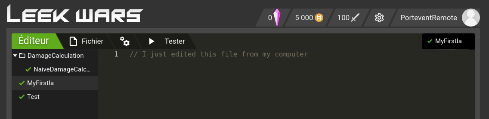

# 🥬 NodeLeek
Simple NodeJs client for LeekWars. Can update scripts, buy items and start fight.  
NodeLeek support the WebSocket connection, so it can read notification and start boss fight.
```typescript
const nodeLeek = new NodeLeekClient("Account", "Password");
await nodeLeek.login();
// Do stuff
await nodeLeek.close()
```
> 💚 NodeLeek connected !  
> 🤠 PorteventRemote (5000 habs)  
> 🥬 PorteAutomatique lvl.1 - 100 talents - ⚠️ 50 capitals to spend

Fight in garden :
```typescript
let myLeek: PublicLeek = nodeLeek.leeks[0];
let opponent: Opponent;
let fightId: number;

[opponent, fightId] = await nodeLeek.startRandomSoloFight(myLeek.id);

console.log("Fighting : ", opponent.name);
console.log("Fight result : ", await nodeLeek.getCompleteFight(fightId));
```

Fight bosses :
```typescript
const roomId = await nodeLeek.createRoom(1); // 1 for Nasu Samurai, 2 for Fennel King, 3 for Evil Pumpkin
// use await nodeLeek.joinRoom(roomId); to join the room with another account
await nodeLeek.startRoomFight();
```

## Get started
Install NodeLeek from [npm](https://www.npmjs.com/package/node-leek) :
```shell
npm install node-leek
```

## Routes supported
Uses OpenAPI to autogenerate API client (specifications are handwritten as no official uptodate spec exists).
Check the [OpenAPI](./src/openapi/leekwars-api.json) specification.  
So far only the most used route are supported, further support will come.

- /farmer
  - /login : partially, some part of the response (such as chat message) aren't done yet
- /garden
  - /get
  - /get-leek-opponnents/{leekId}
  - /get-farmer-opponnents/
  - /start-solo-fight
  - /start-farmer-fight
- /fight
  - /get/{fightId}
- /leek
  - /spend-capital
  - /get/{leekId}
- /marker
  - /buy-habs-quantity
- /ai-folder
  - /new-name
  - /delete
- /ai
  - /save
  - /new-name
  - /delete
  - /sync

# 🔄 LeekSync (WIP)
LeekSync allows you to clone your LeekWars file on your local computer and sync them with a file watcher.  
Open your favorite local IDE, edit some files and they get upload to LeekWars seamlessly.  
If you happen to change your file locally while LeekSync is not running, or you edited file through LeekWars editor, LeekSync will ask you which source to use and update the other to be on the same page

### Download your leekscripts
We recommend using `const nodeLeek = new NodeLeekClient("Account", "Password", true);` to start NodeLeek in read only mode.
This will ensure no modification are done to your leekwars account. Once you downloaded your scripts and have a secured backup, you can remove this readonly flag.
```typescript
  nodeLeek.syncWith("../my-files/", false, "leekwars")
```


You should see your own code in leekscripts folder. Here is an example :

> leekscripts/  
├── DamageCalculation  
│   └── NaiveDamageCalculation.leek  
├── MyFirstIa.leek  
└── Test.leek

### Upload your leekscripts
**We strongly recommend to save your code, copying it or upload it to a Git repository**  
**Uploading an empty folder will result in your leekwars account being just an empty folder.  
Use LeekSync with care, and have a backup**

First, we need to remove the `readonly` option to actually edit our leekwars account.  
You can use the `watch` option to activate the watcher. It will listen to any modification done, and will automaticly push them to Leekwars.

```typescript
  nodeLeek.syncWith("../my-files/", true, "leekwars")
```

Edit your file and refresh Leekwars to see the updated files :




## Help needed
> ❗ Uses outdated package https://www.npmjs.com/package/request because I couldn't make other OpenAPI codegen variants work with cookie authentification. This issue must be resolved to ensure a cleaner code
